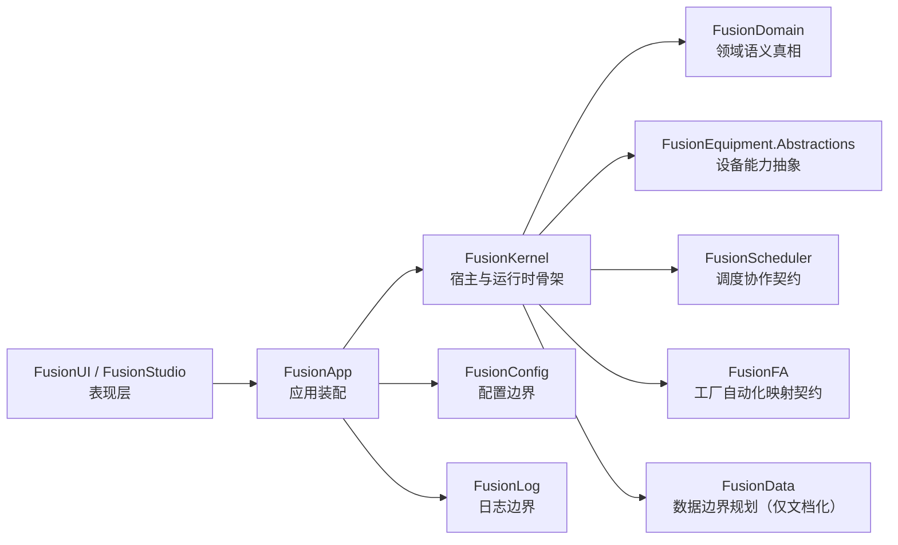

# FusionCore

FusionCore 是一个面向半导体设备场景的开源上位机/PC 控制平台框架，基于 C#、.NET 与 WPF 构建。  
项目采用“架构先行、语义先行”的方式推进，目标不是快速拼装单体软件，而是逐步演进为可多进程协作、可长期治理的设备软件平台。

## 项目定位

FusionCore 主要面向以下人群：

- 半导体设备控制软件开发者
- 设备厂家软件架构师与工程团队
- 希望复用工业软件架构实践的 .NET 开源贡献者

它聚焦解决的问题包括：

- 设备软件模块边界不清、职责耦合严重
- 上位机系统后期难以演进到多进程协作
- 领域语义、调度语义、FA 语义难以统一
- 工业项目从 0 到 1 缺少可复用的架构骨架

## 核心特性 / 亮点

- 模块化架构：按 Domain / Scheduler / FA / UI / Kernel 等边界拆分职责
- 多进程前瞻设计：契约默认面向未来 IPC/RPC 演进，不固化单进程假设
- 领域驱动语义基线：以 `FusionDomain` 维护领域真相与事件目录骨架
- SEMI 标准对齐方向：围绕 E95 等标准做语义映射与边界设计（当前为骨架阶段）
- 架构治理文档完善：`docs/architecture`、`docs/guides` 提供可执行约束

## 架构总览

> 当前为 Phase 1 架构骨架阶段，以下展示的是职责关系与演进方向。



## 模块说明（基于 `FusionCore_Module_Progress.md`）

| 模块 | 职责摘要 | 当前阶段 |
| --- | --- | --- |
| FusionKernel | 宿主、运行时与模块生命周期最小闭环 | P2→P3 |
| FusionConfig | 配置节、快照、Provider 与最小默认接线 | P2→P3 |
| FusionLog | 日志语义、上下文、Writer 与文件写入骨架 | P2→P3 前半段 |
| FusionUI | WPF Shell、导航与只读运行摘要展示 | P2 |
| FusionStudio | 工程工作台（面向开发/调试人员）骨架 | P2 |
| FusionDomain | 领域对象、值对象、枚举与领域事件目录骨架 | P2 |
| FusionEquipment.Abstractions | 设备模块能力抽象与生命周期契约 | P2 |
| FusionScheduler | 调度评估/计划/协调协作契约骨架 | P2 |
| FusionFA | 自动化映射契约、只读视图与命令查询骨架 | P2 |
| FusionApp | 应用装配与最小 bootstrap 入口 | P2 |
| FusionData | 数据管理与存储边界规划（当前仅文档化） | P1（仅文档化） |

## 技术栈

- C# 语言
- .NET（SDK 风格多项目解决方案）
- WPF（FusionUI / FusionStudio）
- xUnit（测试项目）

## 快速上手

### 1) 克隆仓库

```bash
git clone https://github.com/fengyie55/FusionCore.git
cd FusionCore
```

### 2) 还原、构建、测试

```powershell
dotnet restore
dotnet build
dotnet test
```

> 说明：解决方案包含 WPF 项目，建议在 Windows + .NET SDK 环境下进行完整构建与运行。

## 目录结构

- `src/` 生产代码
- `tests/` 自动化测试
- `docs/` 架构与设计文档
- `samples/` 后续阶段预留示例

## 设计约束（节选）

- `FusionDomain` 不依赖 WPF、数据库、网络与驱动实现
- `FusionUI` 仅承载表现层，不承载业务真相
- `FusionScheduler` 不直接控制硬件驱动
- `FusionFA` 聚焦对外自动化投影，不承载设备内部调度
- `FusionEquipment.Abstractions` 仅放置抽象与契约

更多约束请参考：

- `AGENTS.md`
- `docs/architecture/implementation-rules.md`
- `docs/guides/multiprocess-implementation-guardrails.md`

## 项目状态

FusionCore 当前处于 **Phase 1：架构骨架与语义基线建立阶段**。  
现阶段重点是稳定边界、统一语义、保持可构建可测试，而不是提前进入复杂协议、算法与基础设施实现。

如果你关注半导体设备控制软件工程化与架构演进，欢迎关注与参与。

## 贡献指引

欢迎提交 Issue / PR 参与共建。建议贡献前先阅读：

1. `AGENTS.md`
2. `docs/architecture/` 下的基线文档
3. `docs/guides/` 下的工程约定
4. `FusionCore_Module_Progress.md`（了解当前治理阶段）

推荐贡献方向：

- 文档完善与架构可视化
- 骨架阶段的边界一致性改进
- 与当前阶段匹配的最小测试补充

## License

本项目采用 [Apache License 2.0](./LICENSE)。
